## Aufgabe 4: AVL-Baum


### 1. Fügen Sie die acht (Dezimal-)Werte ``2, 6, 13, 45, 29, 15, 22 und 9``


#### Adding 2
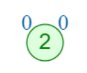

#### Adding 6
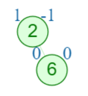

#### Adding 13
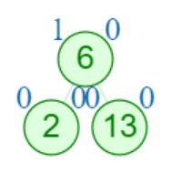

#### Adding 45
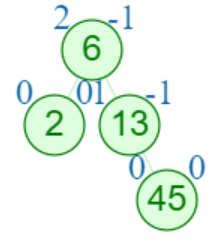

#### Adding 29
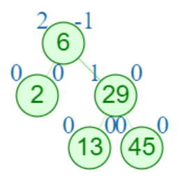

#### Adding 15
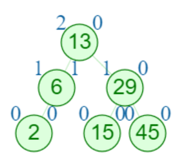

#### Adding 22
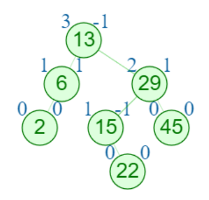

#### Adding 9
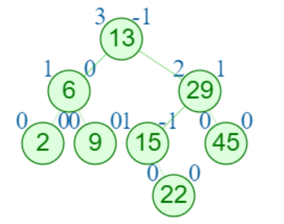

### 2. Bestimmen Sie die Höhe des resultierenden AVL-Baumes.

h = 3

### 3. Löschen Sie die fünf Elemente `29, 9, 13, 15, und 45`

#### Removing 29

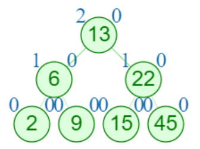

#### Removing 9

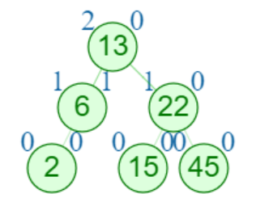

#### Removing 13

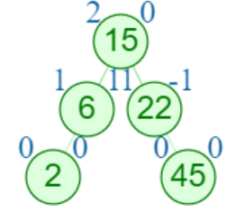

#### Removing 15

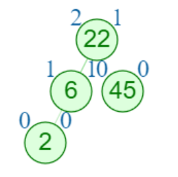

#### Removing 45

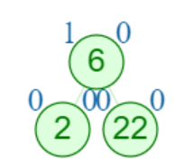

### 4. Beweisen oder widerlegen Sie, dass unabhängig von der Einfügereihenfolge von Elementen in einen AVL-Baum jedenfalls der gleiche AVL-Baum entsteht.

Da der AVL Baum ein geordneter Baum ist, ist die Inorder Traversierung von 2 generierten AVL Bäumen
verschiedener permutationen von ```1 2 3 4 5 6``` 

permutation1 = ```4 5 3 2 1 6```\
permutation2 = ```2 3 5 6 1 4```

die identische Sequenz von Zahlen nämlich:

```1 2 3 4 5 6```

Wenn ``f(elemente)`` nun eine function ist, welche einen AVL Baum generiert und dessen Inorder Traversierung als "ID"
zurückgibt, dann währe gegeben:

``f(permutation1) == f(permutation2)``