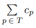

## 1. Wie Sie während der fünften Vorlesung über „Bäume“ erfahren haben, „gilt für jeden vollen Binärbaum, dass die Anzahl seiner externen Knoten genau um 1 größer ist als die Anzahl seiner internen Knoten“.

Auf die Frage, ob „die Eigenschaft eines vollen Binärbaums, dass die Anzahl der externen
Knoten um 1 größer ist als die Anzahl der internen Knoten, im Allgemeinen auf Bäume
übertragen werden [kann]“, liefert ChatGPT1 als Antwort
>Nein, die Eigenschaft eines vollen Binärbaums, dass die Anzahl der externen
Knoten um 1 größer ist als die Anzahl der internen Knoten, kann im Allgemeinen
nicht auf Bäume übertragen werden.
> 
>Ein Beispiel ist ein Baum mit nur einem Knoten, bei dem die Anzahl der externen
Knoten 1 und die Anzahl der internen Knoten 0 ist. 
> 
>Ein weiteres Beispiel ist ein Baum, der nur aus einem Pfad besteht, bei dem alle Knoten außer den
Endknoten intern sind und die Endknoten extern sind. In diesem Fall ist die
Anzahl der externen Knoten um 2 größer als die Anzahl der internen Knoten.

Überprüfen Sie den von ChatGPT erzeugten Text auf Korrektheit und stellen Sie ihn –
sofern nötig – richtig.

### Antwort

> Das erste Beispiel, dass Chat-GPT hier bringt ist falsch, ein Baum mit nur einem Knoten 
> erfüllt immer noch die Eigenschaft da in diesem Fall die Wurzel ein Externer knoten ist und
> somit um 1 größer als die Internen Knoten welche 0 sind.
> 
> Das zweite Beispiel ist Korrekt da in diesem Fall ein nicht vollständiger Binärbaum mit nur einem Pfad ab einer Höhe von 2,
> nicht diese Eigenschaft besitzt.
> 


Abb.1 I = interner Knoten E = externer Knoten

> Im großen und ganzen ist die Aussage von Chat-Gpt wahr, da die eigenschaft bei Regulären Bäumen nicht umbedingt erfüllt sein muss.


## 2. Wie Sie während der fünften Proseminareinheit beim Bearbeiten der Ad-hoc-Aufgaben rund um das Thema „Bäume“ bemerkt haben, hat jeder Baum mit n ≥ 1 Knoten mindestens ein Blatt.

#### Induktionsbasis

## 3. Es sei T ein Baum mit n ≥ 1 Knoten und cp die Anzahl der Kindknoten eines Knotens p ∈ T.

### (a) Beschreiben Sie den mathematischen Ausdruck p ∈ T cp in eignen Worten

 

Bedeuted die Summe aller Kindknoten eines Baumes T

### (b) Beweisen oder widerlegen Sie, dass P p ∈ T cp = n − 1

Beweis durch Induktion

1. Induktionsbasis:

    Ein Baum der nur aus der Wurzel besteht, hat n = 1 Knoten und 0 Kinderknoten, also:
    ```
   n - 1 = 0
   1 - 1 = 0
   0 = 0
   ```
2. Induktionsschritt:

    Die Aussage ist Wahr für alle Bäume mit k + 1 Knoten, wobei k > 1

    Ein Baum mit k Kindknoten muss in der Gesamtsumme k + 1 Knoten besitzen, wegen der Wurzel
    welche nicht als Kindknoten zählt somit kann n mit (k + 1) ersetzt werden

    ```
    (k + 1) <- Gesamtzahl Knoten
   
    n - 1 = (Summe aller Kindknoten k)
    n = (k + 1) - 1 = k
    ```
   
    Die Aussage ist Wahr für einen Baum mit k + 1 Knoten und dadurch gilt es auch 
    für alle Baume mit n Knoten
    
