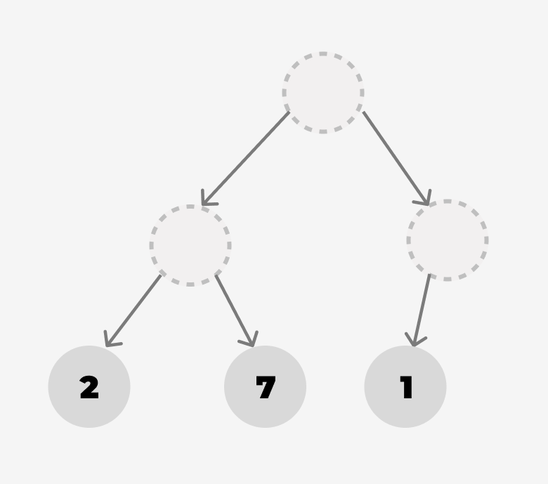
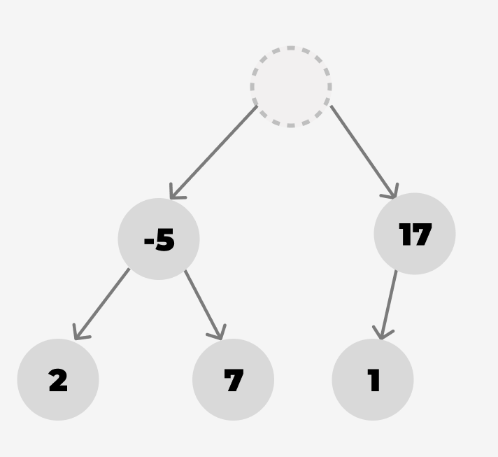
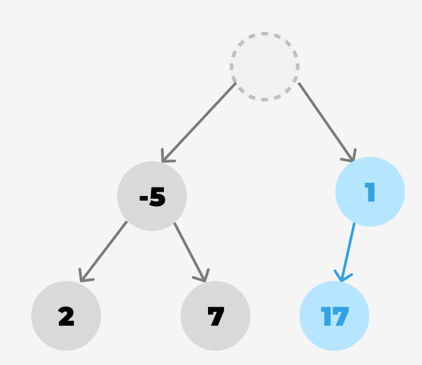
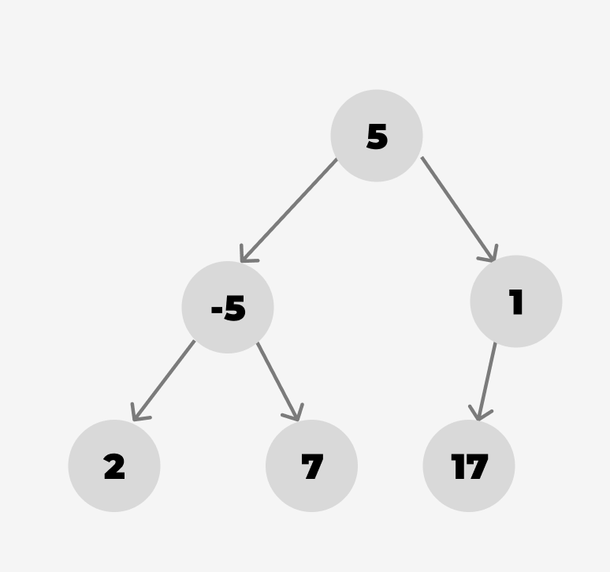
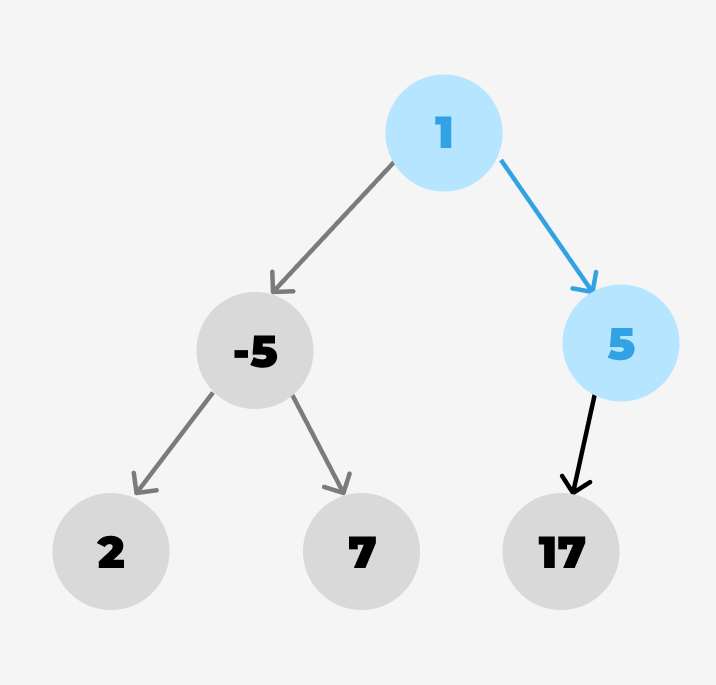
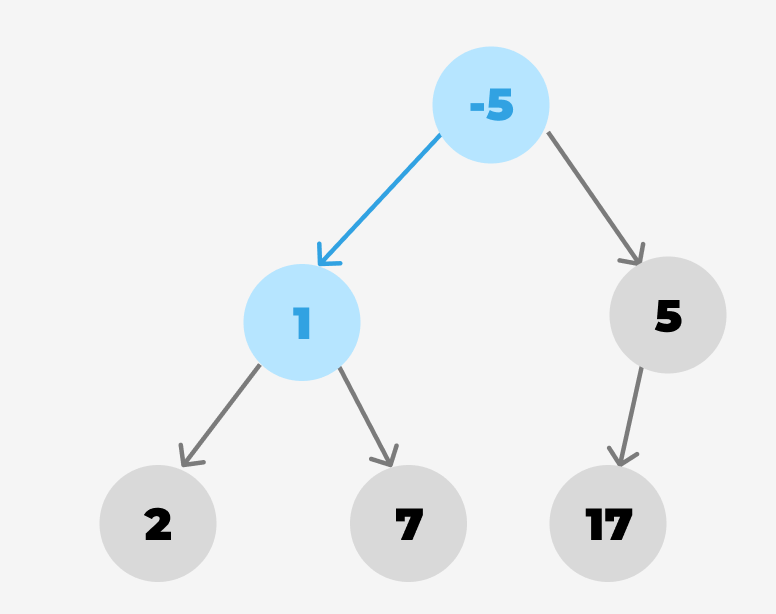
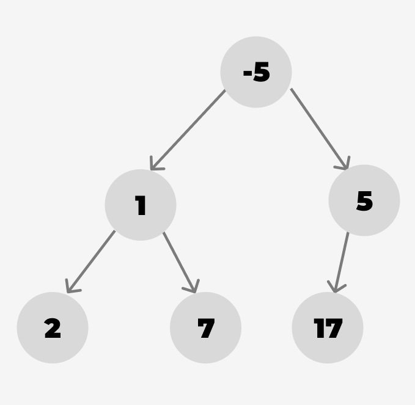

## Sortieren Sie die gegebene Liste mit

- Selection Sort
- Insertion Sort
- Heapsort (mit bottom up heap construction)

und geben Sie die Liste nach jedem Schritt an. Geben Sie zusätzlich bei Heapsort den Heap als
Baumdarstellung in jedem Schritt an.

```2 7 1 -5 17 5```

#### Selection Sort

1. ``-5 7 1 2 17 5``
2. ``-5 1 7 2 17 5``
3. ``-5 1 2 7 17 5``
4. ``-5 1 2 5 17 7``
5. ``-5 1 2 5 7 17``

#### Insertion Sort

1. ``1 2 7 -5 17 5``
2. ``-5 1 2 7 17 5``
3. ``-5 1 2 5 7 17``

#### Heapsort (mit bottom up heap construction)

##### Heap construction

<br>
<br>
<br>
<br>
<br>
<br>
<br>

