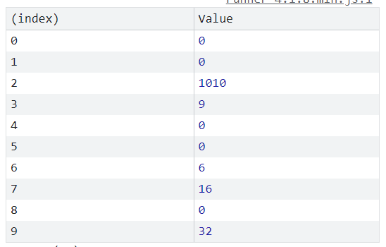

## 1. Alle zugehörigen (maximal) 16 Bit breiten Hash-Codes bestimmen

``h(6) = (6 << 2) ⊕ (6 + 5) = 24 ⊕ 11 = 19``\
``h(9) = (9 << 2) ⊕ (9 + 5) = 36 ⊕ 14 = 42``\
``h(32) = (32 << 2) ⊕ (32 + 5) = 128 ⊕ 37 = 165``\
``h(0) = (0 << 2) ⊕ (0 + 5) = 5``\
``h(1010) = (1010 << 2) ⊕ (1010 + 5) = 4044 ⊕ 1015 = 3135``\
``h(16) = (16 << 2) ⊕ (16 + 5) = 85``

## 2. Entsprechende Hash-Tabelle skizzieren

